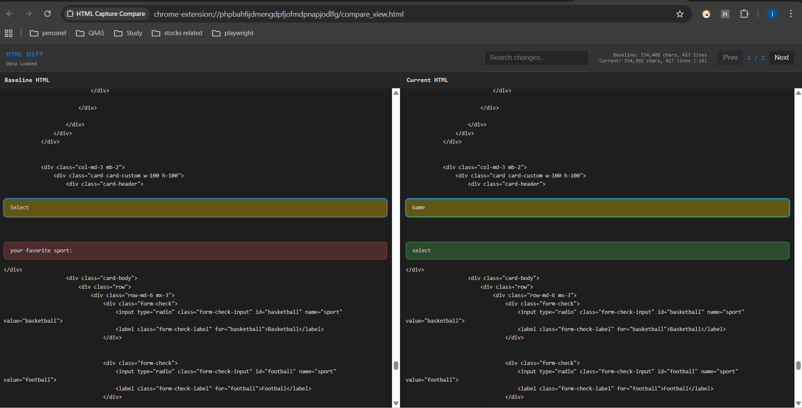
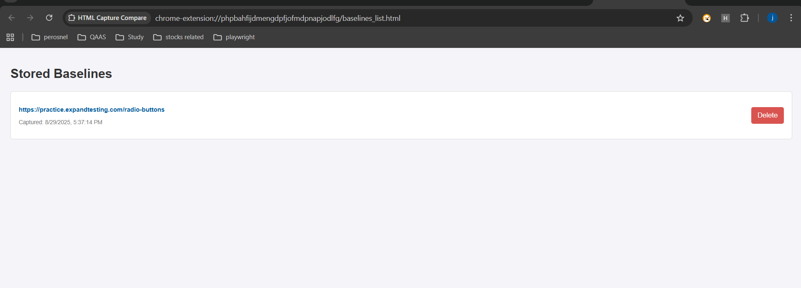

# HTML Capture Compare

## Description

    HTML Capture Compare is a Chrome extension that helps testers and developers analyze failing tests caused by outdated or broken locators.

    Identify & Fix Test Failures – Compare HTML structures to find and fix locator issues.

    Update Locators (Pro Version) – Automatically update locators in your test code using our AI-powered model.

    Smart Suggestions – Get recommendations for new test cases or alternative locators when required.

## Installation

    After cloning the repository:

    Open Google Chrome.
        Click on the Extensions icon in the bookmarks bar.
        Select Manage Extensions.
        Enable Developer Mode (toggle in the upper-right corner).
        Click Load unpacked (upper-left corner).
        In the folder selection window, choose the HTML-diff folder.
        The extension will now appear in your extensions list.
        Pin the HTML-diff extension from the extensions menu for quick access.

## Requirements

    Google Chrome browser

## Usage

    Open the webpage you want to test.

    Launch the HTML-diff extension.

    Select Capture Baseline to save the initial HTML structure of the page.

    Make the desired changes to the HTML structure.

    Click Compare (Side-by-Side) to open a new window showing the baseline vs. changed HTML.

    Use View Changes (Merged) to see the updated structure directly on the webpage.

    Open Manage Baselines to:

        View all your saved baselines with date/time stamps.
        Delete any baseline you no longer need.

## Notes

    The extension is designed for QA testers, automation engineers, and developers who frequently deal with changing locators in test automation.
    The Pro version includes advanced AI-powered locator updates and test case suggestions.
